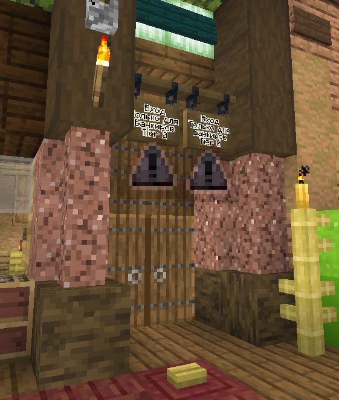
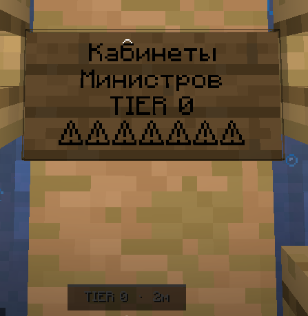
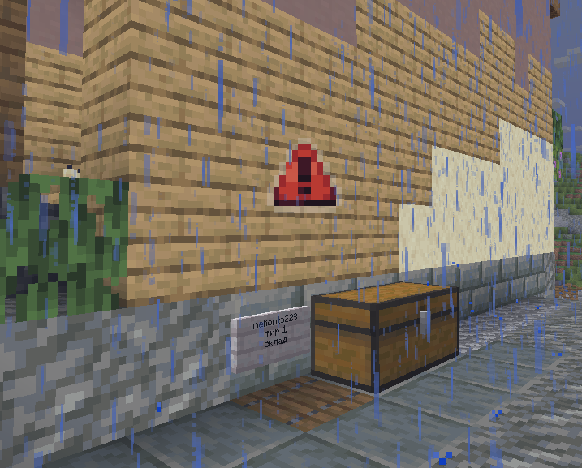

# Improved Tier Signs (Fork)

  
  
  

An enhanced client-side Fabric mod for tracking tier signs.

---

## 📺 Видео демонстрация / Video Demo

### Показ 1
https://github.com/Artur7620/DMCTierSigns/raw/master/media/показ.mp4

### Показ 2
https://github.com/Artur7620/DMCTierSigns/raw/master/media/показ2.mp4

---

## ✨ Особенности / Features
- **Unique Icons** — Свои иконки для каждого тира.
- **Smooth Animations** — Плавное появление и исчезновение.
- **Adaptive Opacity** — Иконка тускнеет вплотную.
- **Universal Support** — Работает на любом сервере.

## ❤️ Credits & Thanks
Огромное спасибо **Dava Wasabi** ([@DavasMueslis](https://t.me/DavasMueslis)) за ценные замечания и предоставленные текстуры! 

---
Found a bug? Open an issue on GitHub!
